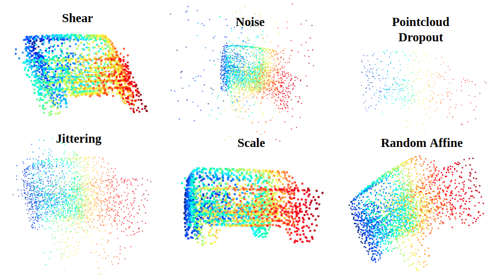

# PointNet++ RandAugment

This repo is implementation for [PointNet](http://openaccess.thecvf.com/content_cvpr_2017/papers/Qi_PointNet_Deep_Learning_CVPR_2017_paper.pdf) and [PointNet++](http://papers.nips.cc/paper/7095-pointnet-deep-hierarchical-feature-learning-on-point-sets-in-a-metric-space.pdf) with Novel data augmentation methods and RandAugment for point cloud data to handle with 3D classification task<br>
Baseline code for PointNet2 mostly borrowed from [erikwijmans/Pointnet2_PyTorch](https://github.com/erikwijmans/Pointnet2_PyTorch)<br>

This repo is 3D pointcloud version of [RandAugment: Practical automated data augmentation with a reduced search space](https://arxiv.org/abs/1909.13719).

* Supports Multi-GPU via `nn.DataParallel <https://pytorch.org/docs/stable/nn.html#torch.nn.DataParallel>`_.

* Supports PyTorch version >= 1.0.0.  Use `v1.0 <https://github.com/erikwijmans/Pointnet2_PyTorch/releases/tag/v1.0>`_
  for support of older versions of PyTorch.

# Setup
-----

* Install ``python`` -- This repo is tested with ``2.7``, ``3.5``, and ``3.6``


* Install dependencies

  ```pip install -r requirements.txt```


* Building `_ext` module

  ```python setup.py build_ext --inplace```


* Optionally, you can also install this repo as a package
  
  ```pip install -e .```


# Training
------------------

Two training examples are provided by ``pointnet2/train/train_sem_seg.py`` and ``pointnet2/train/train_cls.py``.
The datasets for both will be downloaded automatically by default.


They can be run via

```
  python -m pointnet2.train.train_cls

  python -m pointnet2.train.train_sem_seg
```

Both scripts will print training progress after every epoch to the command line.  Use the ``--visdom`` flag to
enable logging to visdom and more detailed logging of training progress.


# Visualization
* Multiple augmentations were deployed.(Check below image that shows some examples of augmentation methods)<br>
  `python ./data/pointnet2/ModelNet40Loader`



# Classification Result
|classfication|acc|
|:---:|:---:|
|PointNet++(Official, w/o normal)|90.7|
|PointNet++(Official, with normal)|91.9|
|**Ours**|**92.9**|

Citation
--------

```
  @article{pytorchpointnet++,
        Author = {Seungjun Lee},
        Title = {Pointnet++ RandAugment},
        Journal = {https://github.com/seungjunlee96/PointNet2_RandAugment},
        Year = {2020}
  }

  @inproceedings{qi2017pointnet++,
      title={Pointnet++: Deep hierarchical feature learning on point sets in a metric space},
      author={Qi, Charles Ruizhongtai and Yi, Li and Su, Hao and Guibas, Leonidas J},
      booktitle={Advances in Neural Information Processing Systems},
      pages={5099--5108},
      year={2017}
  }
 ```

# Brief summary of RandAugment
The primary goal of RandAugment is to remove the need for a separate search phase on a proxy task.<br>
There are only two parameters to tune the RandAugment
- N, Number of augmentation transformation to apply sequentially.
- M, Magnitude for all the transformations
Below code shows applying RandAugment.(code from original paper of RandAugment)
```python
transforms = [
’Identity’, ’AutoContrast’, ’Equalize’,
’Rotate’, ’Solarize’, ’Color’, ’Posterize’,
’Contrast’, ’Brightness’, ’Sharpness’,
’ShearX’, ’ShearY’, ’TranslateX’, ’TranslateY’]
def randaugment(N, M):
"""Generate a set of distortions.
Args:
N: Number of augmentation transformations to
apply sequentially.
M: Magnitude for all the transformations.
"""
sampled_ops = np.random.choice(transforms, N)
return [(op, M) for op in sampled_ops]
```
# To Do
- Training and evaluation on Segmentation
- SSG vs MSG
- More Data augmentation methods


# Reference By
[yanx27/Pointnet_Pointnet2_pytorch](https://github.com/yanx27/Pointnet_Pointnet2_pytorch)<br>
[erikwijmans/Pointnet2_PyTorch](https://github.com/erikwijmans/Pointnet2_PyTorch)<br>
[ildoonet's RandAugment](https://github.com/ildoonet/pytorch-randaugment)<br>
[halimacc/pointnet3](https://github.com/halimacc/pointnet3)<br>
[fxia22/pointnet.pytorch](https://github.com/fxia22/pointnet.pytorch)<br>
[charlesq34/PointNet](https://github.com/charlesq34/pointnet) <br>
[charlesq34/PointNet++](https://github.com/charlesq34/pointnet2)
